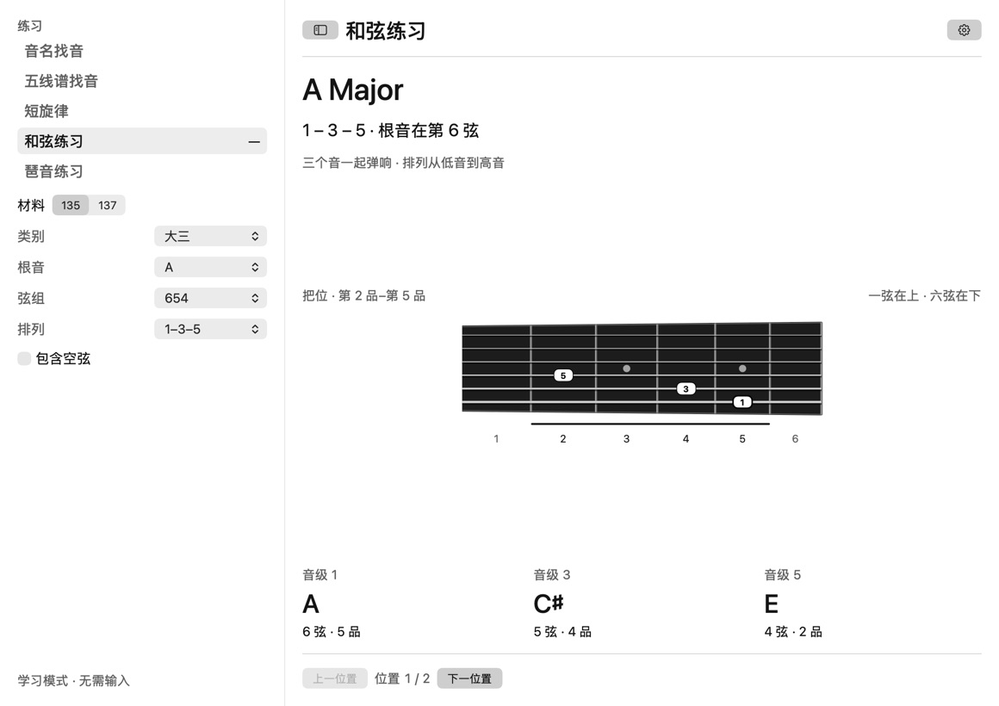
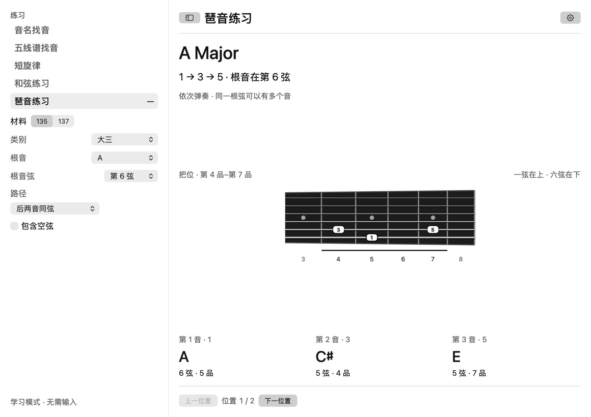
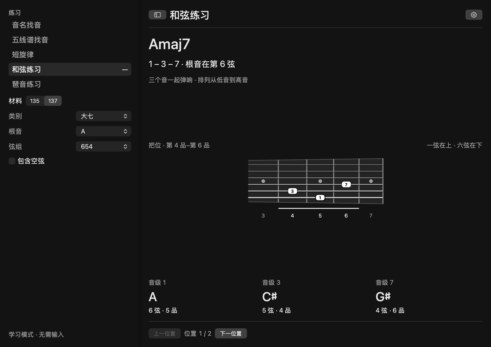
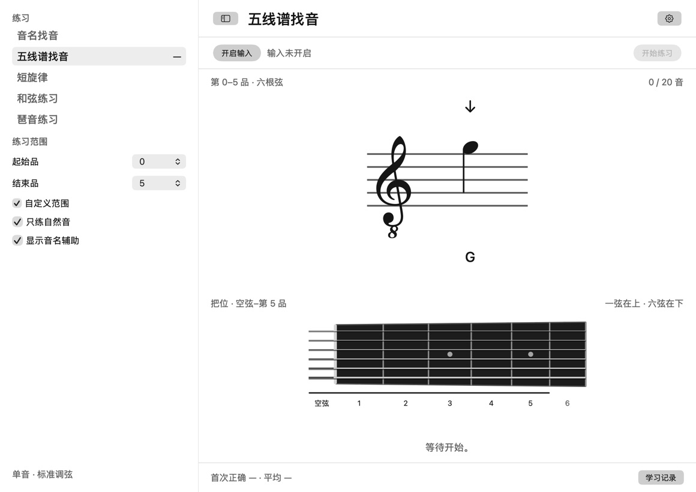
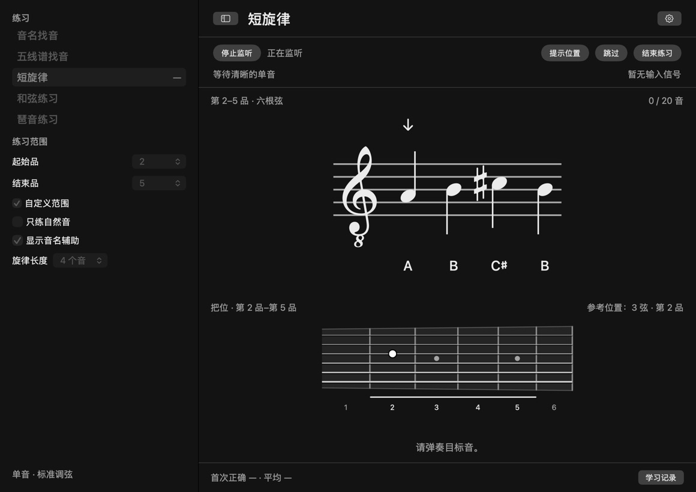
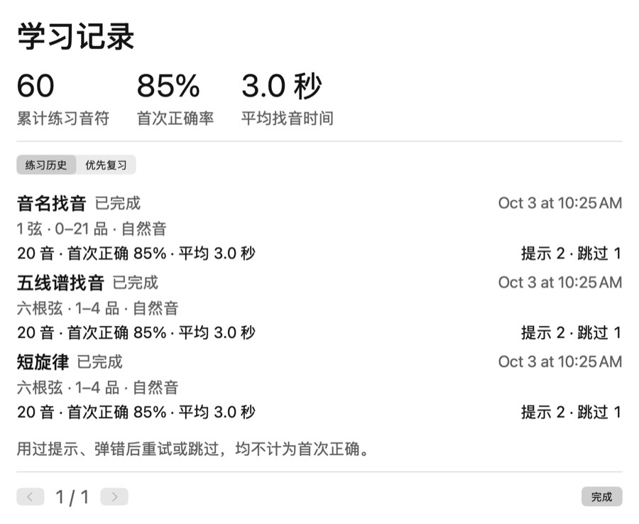

# FretNote

[English](README.md) · **简体中文**

[下载 macOS 版](https://github.com/lele94218/FretNote/releases/latest) · [反馈问题](https://github.com/lele94218/FretNote/issues)

在 macOS 本机，通过声卡听电吉他单音，练指板、音名和五线谱。

界面采用黑白配色、细分隔线和简洁控件。“FretNote → 设置…”（`⌘,`）中的“外观”支持浅色、深色和跟随系统；“字号”可在 100%–175% 之间调节，默认 125%。文字按所选字号显示，五线谱和指板按窗口可用空间等比例适配，主题和字号在退出后保留。五线谱用箭头标记当前音，已完成的音变灰；判定通过文字和符号显示。下拉选择使用 macOS 原生菜单：紧凑行高、系统选中标记、方向键选择与 Esc 关闭；菜单字号随界面设置调整，尺寸由系统按内容计算。谱面与指板保持真实比例，根据窗口宽高统一缩放，全部音符与练习把位保持可见，无需横向或纵向滚动。侧栏可拖动调整宽度或通过 `⌃⌘S` 隐藏，字号放大不会同比扩大侧栏。指板品距按十二平均律逐品缩短，并显示常见品位标记。

## 界面预览

以下为实际 App 界面，使用演示数据，不包含个人学习记录。练习页面截图统一使用 1160 × 820 点窗口、125% 字号；所有练习共用同一指板比例和绘图高度上限。

### 和弦练习 · 135



### 琶音练习



### 和弦练习 · 137 · 深色



### 五线谱找音 · 浅色



### 旋律与把位提示 · 深色



### 学习记录



## 下载与安装

从 [GitHub Releases](https://github.com/lele94218/FretNote/releases/latest) 下载 `FretNote-v0.3.1-macOS-arm64.zip`，解压后将 `FretNote.app` 拖入“应用程序”。需要 **Apple Silicon（M 系列）Mac、macOS 13 或更新版本**。当前发布包不支持 Intel；Intel 用户可尝试从源码构建，尚未验证。

应用目前只有中文界面；文档提供中英文。发布包采用临时签名，尚未通过 Apple Developer ID 签名和公证，macOS 可能阻止首次打开。仅在确认来源后按 [Apple 的说明](https://support.apple.com/102445)处理，或自行从源码构建。

## 指板学习

侧栏「和弦练习」「琶音练习」与音名找音、五线谱找音、短旋律并列。选择后直接查看完整指型，无需连接吉他、麦克风权限或任何答题输入。可选择 135／137、类别、根音、弦组或根音弦，并用「上一位置／下一位置」浏览不同八度。指板标出音级，下方显示音名与弦品。

135 包含大三、小三、增三、减三；137 仅包含大七、属七、小七。135 和弦支持三种音级排列；琶音可查看前两音同弦、后两音同弦、每弦一个音三条路径。空弦可选，默认关闭；自动显示完整指型跨度，不强制四品范围，最高仍为 21 品。

学习不评分、不改变熟练度。进入学习会停止音频采集，返回练习后需手动开启。当前新增的是看图学习，和弦多音判定与琶音评分练习尚未实现。

## 开始使用

1. 打开 `FretNote.app`。
2. 吉他接声卡，使用标准调弦（六弦到一弦：E2 A2 D3 G3 B3 E4）、干净音色。
3. 点击右上角设置按钮，在“音频输入”选择声卡及吉他所在的输入通道，例如 Scarlett 2i2 的 Input 1。
4. 点击“开始监听”，首次使用允许麦克风权限。macOS 对声卡输入同样需要这项权限。
5. 返回主窗口，先弹几下，确认电平有反应、识别到的音正确，再点击“开始练习”。

主界面采用单屏布局：输入和练习操作固定在顶部，谱面与指板共享中间可用空间，底部显示本组成绩。“学习记录”按钮打开详细记录；设置分为“外观”和“音频”两个页签，均不需要上下滚动。最小窗口为 1040 × 740 点。菜单栏“练习”提供快捷键：`⌘Return` 开始／结束、`⇧⌘H` 提示、`⌘→` 跳过、`⇧⌘I` 开启／停止监听。完成弹窗可按 Return 关闭。

每组 20 个音，可以提前结束。弹错后可以继续尝试；提示和跳过会降低该音的熟练度，后续更常出现。

五线谱找音和短旋律默认练习连续四个品格，只需选择起始品：例如起始第 5 品，范围自动为第 5–8 品。初始为第 1–4 品。按 21 品电吉他设置上限，默认四品把位最晚从第 18 品开始（18–21 品），自定义范围可选到第 21 品，指板不会显示第 22 品及以上。勾选“自定义范围”后可分别设置起始品、结束品，也可从 0（空弦）开始；关闭自定义即恢复四品范围。

## 三种练习

- **音名找音**：琴弦可多选（至少一根），每题明确指定其中一根，多选时相邻题切换琴弦；在题目指定弦的空弦到第 21 品之间找 G 等音名，不限制把位。同一根弦上不同八度的同名音均可通过；提示只给出一个参考位置。
- **五线谱找音**：只限制把位，不限制琴弦，所选品位范围内六根弦上的音都参与出题（可选只练自然音）。可以关闭音名辅助，下方常驻显示当前吉他把位；点击“提示位置”后才显示一个参考答案位置。
- **短旋律**：在指定品位范围内弹 3–5 个音，逐音验证音高和顺序。每组最后一题会缩短以凑齐 20 音。五线谱下常驻六弦指板图，采用黑色琴颈、金属品丝和由细到粗的六根弦；一弦在上、六弦在下，不显示左侧弦号和调弦标签。下方短线标出练习范围，保留品号；相邻品用于定位。点击“提示位置”后才标出当前音的参考位置。空弦显示在琴枕左侧。

五线谱使用吉他常用的八度移调高音谱表：**谱面比实际声音高一个八度**，谱号下的小 8 表示实际发声低八度。输入区显示的是实际音高，如一弦三品显示 G4；谱面对应 G5。

## 判定与边界

- 第一版只支持单音，暂不评估节奏、和弦、推弦或滑音。
- 五线谱和旋律验证实际音高及八度，音名模式接受指定弦可弹范围内的同名音；无法从音高可靠区分同音的不同弦/品位。请自行遵守题目位置要求。
- 需连续检测到稳定音高，允许约 ±40 音分偏差。模糊信号或噪声不计为答错。
- 延音不会持续重复答题。重复同音时轻闷弦再拨，更容易识别；强烈的新起音也可重新触发。
- 避免同时振动多根弦，关闭失真、混响和延迟。高泛音、严重失真或多音输入仍可能造成误判。
- 噪声门默认 −45 dBFS。小音量不识别时可停止监听，调低噪声门后重新开启；若输入削波则降低声卡增益。
- 设备拔插或采样率变化后会停止监听，请刷新设备并重新开始。
- 第一版未经过真人吉他输入准确率评估；自动测试使用合成信号，不能代替你的实际声卡试用。

## 本地数据

音频仅在内存中处理，不录音、不上传，无网络依赖。

学习记录保存于：

```text
~/Library/Application Support/FretNote/progress.json
```

“学习记录”提供累计练习音符数、首次正确率、平均找音时间，以及按时间倒序的练习历史。每组保存日期、模式、琴弦或把位范围、自然音设置、完成音符数、正确率、平均用时、提示和跳过次数；完成每个音后自动落盘，提前结束也保留，空练习不记录。历史与优先复习列表均分页显示，无需滚动，支持深浅色和字号设置。旧版累计数据自动兼容，旧练习的日期和分组无法补回。

熟练度记录以“弦 + 品位”为单位，包含首次正确率、耗时、提示次数及下次复习时间。不同练习模式暂时共享熟练度。复习采用加权抽题，尚未到期的音也可能出现。读取失败时保留原文件并停止覆盖，界面会提示错误。

## 开发与打包

需要 macOS 13+、Xcode / Swift 5.9+。无第三方代码依赖。内置 Bravura 乐谱字体（SIL Open Font License 1.1），离线可用，无需安装系统字体。

```bash
swift test
bash scripts/build-app.sh
open "$HOME/Applications/FretNote.app"
```

请使用打包后的 `.app` 进行音频测试，确保应用身份和麦克风用途说明正确。构建产物为本机架构，采用本机临时签名，未进行 Developer ID 公证。更新签名后，macOS 可能要求重新授权麦克风。

可直接在 Xcode 打开 `Package.swift` 编辑代码。CI 在 GitHub Actions 上执行测试并生成应用 ZIP。

可选的界面快照验证（会短暂打开测试窗口，不访问音频）：

```bash
FRETNOTE_SNAPSHOT_DIR=/tmp/fretnote-preview swift test --filter testRender
```

## 代码结构

```text
Sources/FretNoteCore/       音高识别、音符门控、指板映射、题目和复习权重
Sources/FretNoteApp/        SwiftUI 界面、五线谱、Core Audio 输入、本地记录
Tests/                     合成音频与练习状态测试
Resources/Info.plist        应用信息与音频权限声明
scripts/build-app.sh        本机应用打包并安装
scripts/make-icon.swift     可复现的应用图标绘制
Resources/AppIcon.svg      图标矢量源文件
```

音频链路：Core Audio 枚举设备 → AVAudioEngine 输入 tap → 选择单通道 → 独立串行队列降采样 → YIN 音高估计 → 稳定音符事件 → 练习状态机。

选择控件参考 Apple 的 [Pop-up Buttons 设计规范](https://developer.apple.com/design/human-interface-guidelines/pop-up-buttons)，通过 AppKit `NSPopUpButton` 实现。

使用 Apple 原生 [AVAudioEngine 输入节点](https://developer.apple.com/documentation/avfaudio/avaudioengine/inputnode)。算法测试覆盖 MIDI 40–88 的纯音与较强二次泛音、音分偏差、静音/噪声、持续音与重新拨弦；练习测试覆盖谱面八度、把位约束、判题、提示及持久化。

## 后续方向

- 用真实吉他录音建立音频回归样本，针对声卡和拨弦方式调整判定。
- 区分音名与识谱熟练度，增加更明确的每日复习队列。
- 加入节拍和节奏练习、听旋律后弹奏。
- 增加降号、调号及更多把位练习。

五线谱使用 [Steinberg Bravura](https://github.com/steinbergmedia/bravura) 字体及其 SMuFL 元数据。音头、八度高音谱号、升降号使用同一套字形；符干按连接锚点和 3.5 个谱线间距绘制。字体、元数据及许可证位于 `Sources/FretNoteApp/Resources/`，随应用打包。

打包脚本将应用安装到 `~/Applications/FretNote.app`，中间产物在隐藏的 `.build` 目录中生成并自动清理。旧的 `dist/FretNote.app` 会在安装成功后移除，避免系统显示两个应用入口；学习记录仍保存在原来的 Application Support 目录。

## 贡献与许可

欢迎提交 Issue 和 Pull Request。提交前运行 `swift test`，涉及音频时请注明设备、macOS 版本和复现步骤；请勿提交个人学习记录、凭据或未经授权的录音。

项目代码采用 [MIT License](LICENSE)。内置的 Bravura 字体及其元数据保留原许可，详见 [Bravura 许可证](Sources/FretNoteApp/Resources/Bravura-LICENSE.txt)。
